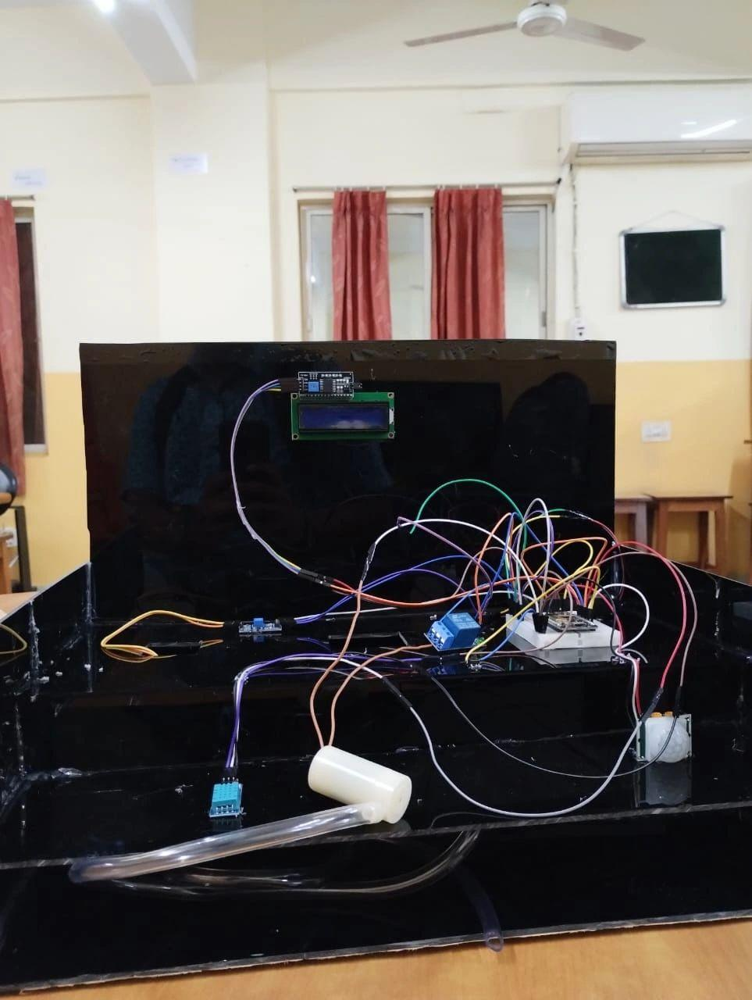
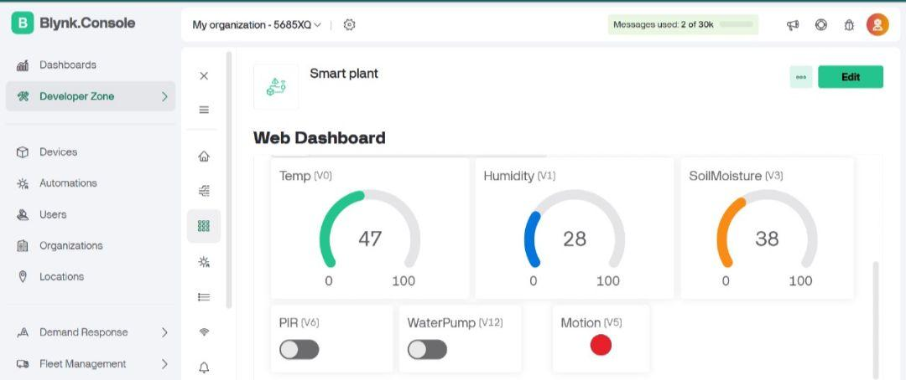

# Smart Plant Monitoring and Watering System

This project implements an IoT-based smart plant monitoring and automatic watering system using ESP32 and Blynk IoT.

The system monitors temperature, humidity, soil moisture, and motion. Based on soil moisture levels, it automatically controls a water pump to irrigate plants.

## Features

- Real-time monitoring using Blynk dashboard
- Automatic irrigation based on soil moisture threshold
- Motion detection using PIR sensor
- Remote control via mobile app
- Live data visualization

## Components

- ESP32
- DHT11 Sensor
- Soil Moisture Sensor
- PIR Sensor
- Relay Module
- Water Pump
- LCD Display (I2C)
- Blynk IoT

## Working

ESP32 collects data from sensors and sends it to Blynk. When soil moisture drops below threshold, relay activates pump. User can monitor everything remotely.

## Blynk Virtual Pins

- V0 Temperature
- V1 Humidity
- V3 Soil Moisture
- V5 Motion
- V12 Pump Control

## Setup

1. Install Arduino IDE  
2. Install ESP32 board package  
3. Install libraries:  
   - Blynk  
   - DHT sensor library  
   - LiquidCrystal I2C  
4. Update credentials in config.h  
5. Upload code  

## Output

### System Overview

Project completion certificate

### Hardware Setup
.jpeg)

Physical implementation including ESP32, sensors, relay module, LCD, and water pump connections.

### Blynk Dashboard

Real-time monitoring interface displaying temperature, humidity, soil moisture, and system status.

## Author

Arnish Saha
